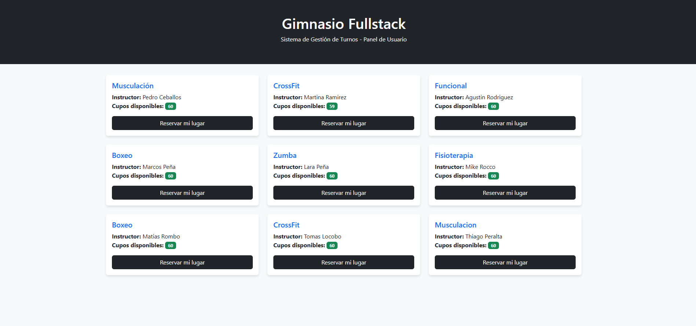

🏋️‍♂️ Sistema de Gestión de Reservas - Gimnasio Fullstack

¡Bienvenido! Este es un sistema de gestión de turnos desarrollado para digitalizar la reserva de clases en un gimnasio. El proyecto demuestra la integración de una API robusta en Java con una interfaz de usuario dinámica.

🚀 Tecnologías y Herramientas

Backend: Java 21 con el framework Spring Boot 3.4.x.

Base de Datos: H2 Database (en memoria), ideal para pruebas rápidas de desarrollo.

Seguridad y Lógica: Validación de cupos y disponibilidad de socios en tiempo real.

Documentación: Swagger UI (OpenAPI 3) para visualizar y probar todos los endpoints.

Frontend: Aplicación de una sola página (SPA) usando Vanilla JavaScript, HTML5 y Bootstrap 5 para un diseño responsivo.

🛠️ Funcionalidades del Sistema

Gestión de Socios: Creación y listado de usuarios del gimnasio.

Administración de Clases: Registro de actividades con instructor, horario y capacidad máxima.

Motor de Reservas: Lógica de negocio centralizada que descuenta cupos automáticamente al confirmar un turno.

💻 Instalación y Uso

Clonar el proyecto:

Bash

git clone https://github.com/Mateo-Nicolas-Capurro/gym-reservas-project.git
Ejecutar: Abrir en IntelliJ IDEA y correr la clase ReservasGymProjectApplication.

Acceso:

Página Web: http://localhost:8080/index.html

Documentación API: http://localhost:8080/swagger-ui/index.html

